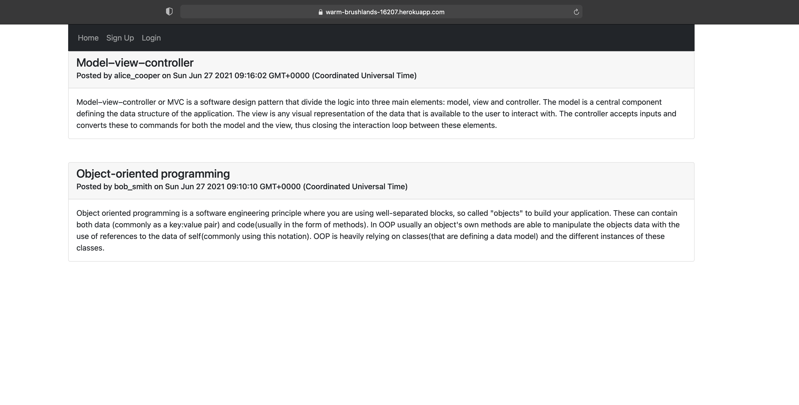
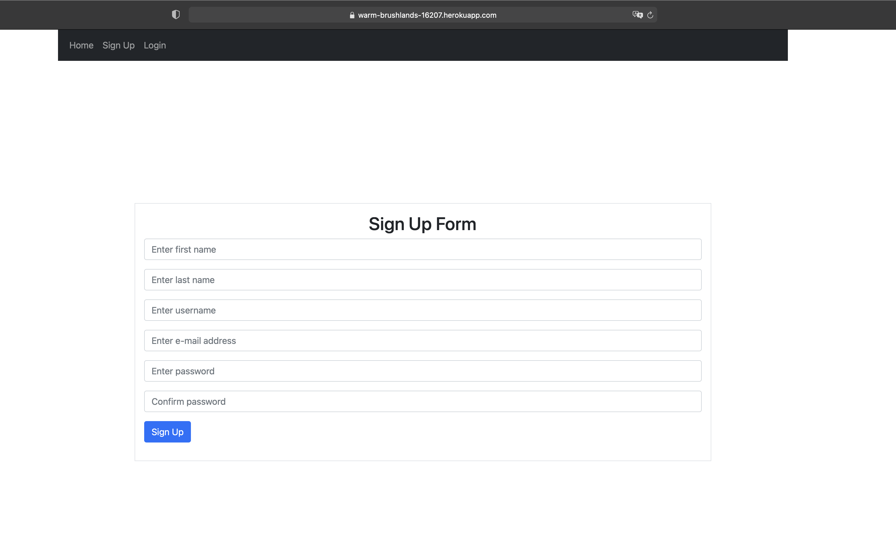
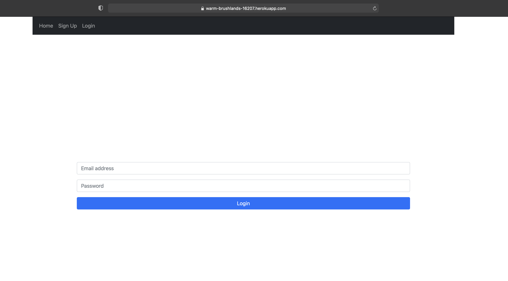
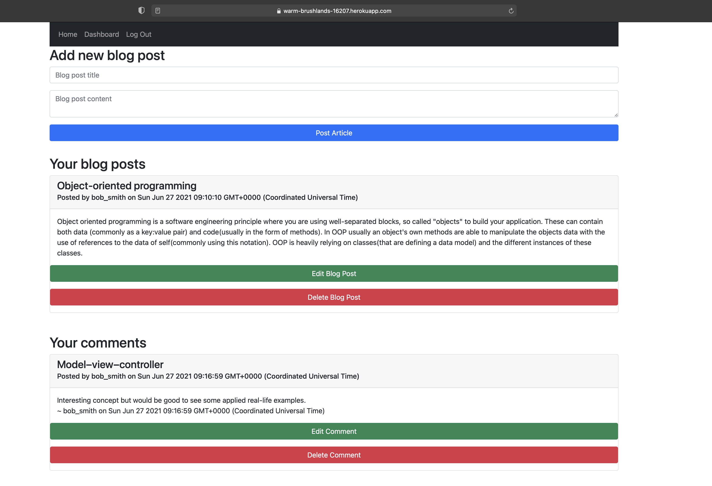
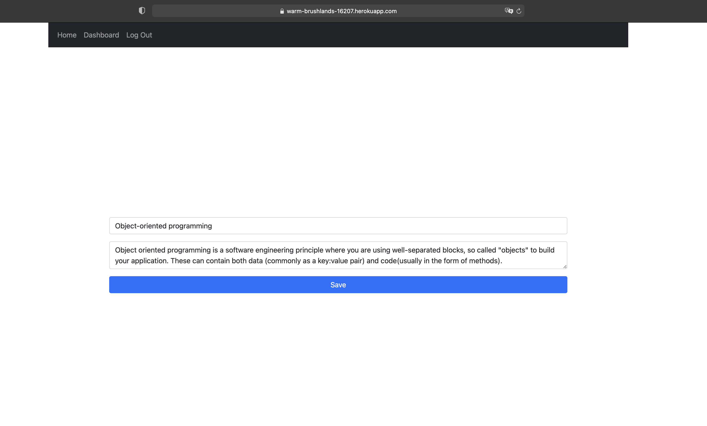
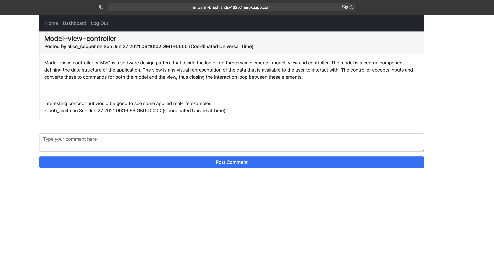

# Full Stack Tech Blog

## Description

In this project I have created a full-stack MVC application for a blog engine where users can create an account, log in and post and edit articles and comments.

## What I have done

- [x] Created data models using Sequelize
- [x] Created controllers to render and manipulate data
- [x] Created API and view routes including route protection for unauthorized users
- [x] Used handlebars.js as the templating engine of the application
- [x] Used jQuery for client-side interactions
- [x] Used Bootstrap for design

## Installation

```
git clone https://github.com/ivnkris/full-stack-tech-blog
cd full-stack-tech-blog
npm install
---> Open up the mySQL workbench and copy and execute the contents of src/db/schema.sql
npm run seed
npm run start
```

## Contributing

Submit a pull request

## Scripts

```
npm run start
npm run seed
npm run dev
```

## Link to GitHub repository

https://github.com/ivnkris/full-stack-tech-blog

## Link to deployed application

https://warm-brushlands-16207.herokuapp.com

## Screenshots








## Questions

- Send any questions via my [GitHub profile](https://github.com/ivnkris)
